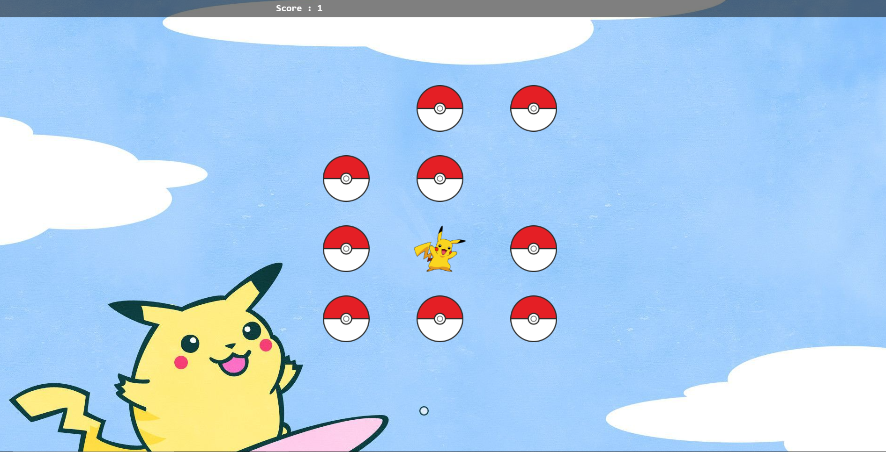

# Pokemon Memory Game

## Introduction

If you're not familiar with this game, the rules are pretty simple! There are 12 cards in total, including 6 main cards and their copies. At the start of each game the cards are shuffled. The player turns the cards and tries to find a match.

## Deployment Link

You can play the game via the link below.

https://pokemon-memory-game-bt.herokuapp.com/

## Installation

* Clone project to your computer
`git clone https://github.com/baristunar/memory-game-pokemon`

* Install dependencies
`yarn install`

* Start server in your local
`yarn start server`

## Contact

* <a href="mailto:tunarbaris7@gmail.com">Email</a>
* [Twitter](https://twitter.com/baristunar)
* [Linkedin](https://www.linkedin.com/in/baristunar/)
* [Github](https://github.com/baristunar)
## Repository

[memory-game-pokemon](https://github.com/baristunar/memory-game-pokemon)